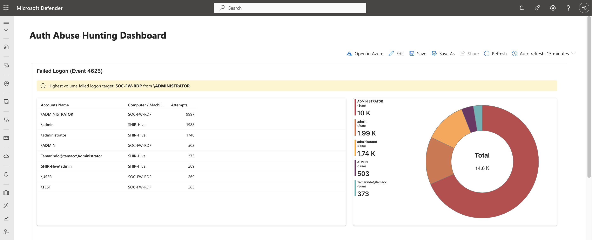
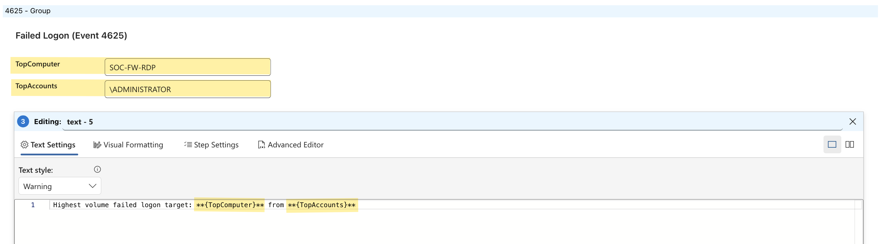
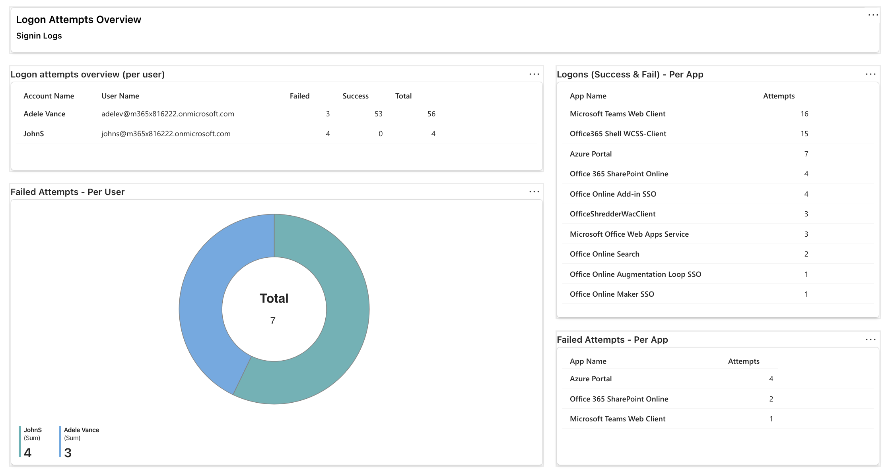

# Microsoft Sentinel Workbook - Auth Abuse Hunting Dashboard

**Personal goal:** get more comfortable with Microsoft Defender and Sentinel by building and using a real workbook for hunting in my lab (KQL, workbook layout, and turning logs into something actionable).

I’ll keep improving on it as I learn, adding new panels, better parsing/enrichment, and correlation logic over time.
### **The workbook**
This workbook is built to spot and prioritize authentication abuse across the lab by combining:
- Windows Security Events (`SecurityEvent_CL`) - mainly 4625 (failed logons) to surface brute-force and  high volume auth failures on hosts/local accounts
- Entra ID Sign in Logs (`SigninLogs_CL`) - to track cloud sign-in success/failure, high volume sign in activity of users/apps, and pivot fast by identity / app/location

It’s designed to answer:
- Which host is being hit the most?
- Which account is being targeted the most?
- Are failures concentrated on specific users, systems, or apps?
## **Windows failed logons (4625)**
This section focuses on high volume failed logons and the biggest targets


### **Failed Logons - KQL Query**
```KQL
SecurityEvent_CL 
	| where EventID_s == "4625"
	| summarize Accounts = count() by Account_s, Computer
	| where Accounts > 250
	| sort by Accounts desc 
```

### **Parameters**
While digging into workbook structure, I noticed parameters can do more than just filter charts, so I decided to try them here as a simple highlight to mix dynamic variable with human readable text.

#### **Highest Targeted Hosts  & Accounts** 



##### Hosts - `TopComputer`
```KQL
SecurityEvent_CL
	| where TimeGenerated > ago(7d)
	| where EventID_s == "4625"
	| summarize Failed = count() by Computer
	| top 1 by Failed desc
	| project Computer
```

##### Accounts `TopAccount`
```KQL
SecurityEvent_CL
	| where TimeGenerated > ago(7d)
	| where EventID_s == "4625"
	| summarize Failed = count() by Account_s
	| top 1 by Failed desc
	| project Account_s
```


---
## Entra ID Sign-ins
The goal is to quickly spot identities under the most sign in pressure, see whether failures are isolated or spread across multiple apps, and understand what’s driving the activity so I can separate expected behavior from suspicious patterns.



This part of the dashboards includes: 
- Per user u (failed / success / total) to identify high failure accounts fast.
- Failed attempts per app to see whether failures are concentrated on one service (likely configuration or policy) or spread across many apps (more suspicious)
### **Entra sign-in logs help confirm:**
- whether activity is cloud based vs hosts based
- if one user is failing across multiple apps (spray / password issues / MFA friction)
- which apps are generating the most failed sign-ins
#### **Logon attempts overview (per user) - KQL**
```KQL
SigninLogs_CL
	| summarize Failed=countif(ResultType != 0), Success=countif(ResultType == 0), Total=count() by UserDisplayName_s, UserPrincipalName_s
	| where Failed > 0
	| sort by Failed desc, Total desc
```

#### **Failed attempts per app - KQL**
```KQL
SigninLogs_CL
	| where TimeGenerated > ago(7d)
	| where ResultType != 0
	| summarize Attempts = count() by AppDisplayName_s
	| sort by Attempts desc
```

### Practical notes & Takeaways
- Grouping failures by app in SigninLogs_CL is a quick way to see whether activity is concentrated around a specific service or spread across several apps.
- Parameters were worth using here because they can drive a short highlight line (TopComputer / TopAccount) and act as reusable pivots across multiple panels.
- Building this forced  KQL practice such `where`, `summarize`, `countif`, `top`, `project`, and using thresholds to keep tables actionable.
- Not everything shows up in the same place. For example, I couldn’t find IPAddress in my Windows SecurityEvent_CL 4625 data, but it was available in SigninLogs_CL, so that became the better place to pivot by IP (and then by user/app).

### **Future improvements & ideas**
Next updates I want to add as the lab and workbook evolve:
- Correlation panels (`4625` - `4624` “success after failures”, burst patterns)
- Remote access and spray indicators: RDP-focused failures (LogonType 10) plus source IPs targeting multiple user accounts.
- Generating more logs and introducing additional operators (like join and union) to correlate multiple tables for improved visibility and richer context.
### **Resources**
- [MYDFIR Community ](https://www.mydfir.com/)
- [Microsoft Certified: Security Operations Analyst Associate](https://learn.microsoft.com/en-us/credentials/certifications/security-operations-analyst/?practice-assessment-type=certification)
- [Azure Sentinel Repository](https://github.com/Azure/Azure-Sentinel)
